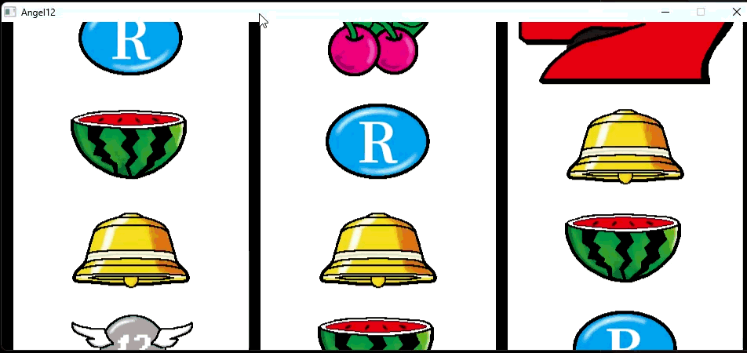

# Slot Angel12
## 概要
- 3リールのAタイプスロット
- C++とSDL3を用いてスクラッチで開発中です。

## デモ


## 起動方法
- `\build\Angel12.exe`を起動

## 操作方法
| キー    | 内容     |
| ----- | ------ |
| ↑ / RCTRL / W| レバーON  |
| RSHIFT | レバーON  |
| ← / A  | 左リール停止 |
| ↓ / S  | 中リール停止 |
| → / D     | 右リール停止 |

## 注意点
- 押し順は左→右→中しか実装していません。
- リール制御が甘くごくまれに停止パターンが見つからずフリーズします。
- レギュラーボーナスを消化出来ません。

## ビルド環境
- g++ 20 or higher 
- ninja
- cmake

## ビルド方法
- SDL3はvendored版を使用しているため環境構築不要です。
```
git clone --recursive
mkdir build
cmake -G "Ninja" -D CMAKE_CXX_COMPILER=g++ -B build
cmake --build build
```
